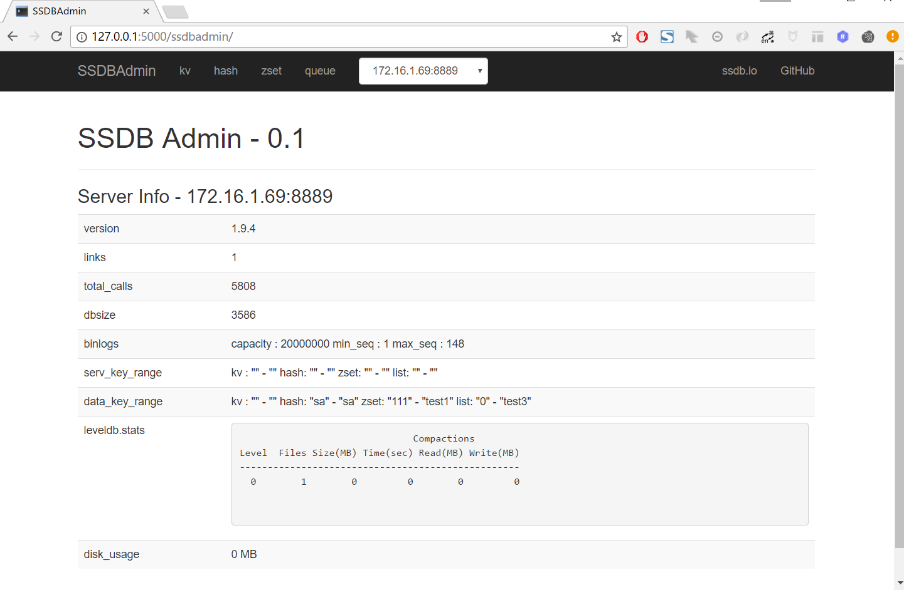
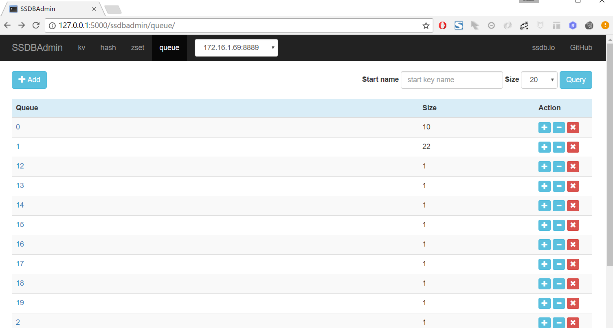

SSDBAdmin
=======
[](https://travis-ci.org/jhao104/SSDBAdmin)
 
[](https://requires.io/github/jhao104/SSDBAdmin/requirements/?branch=master)
[](http://www.spiderpy.cn/blog/)

SSDB数据库的可视化界面管理工具


## 功能
    提供SSDB数据的hash/zset/kv/queue等数据结构的增删改查等功能 

## 依赖

* Python 3.x  (Python2请移步[py2](https://github.com/jhao104/SSDBAdmin/tree/dev_py2))

* Flask

## 安装

下载项目到本地`git clone https://github.com/jhao104/SSDBAdmin.git`

编辑配置文件`SSDBAdmin/setting.py`:
```
# SSDB config
DB_CONFIG = [
    {
        "host": "127.0.0.1",
        "port": 8888
    },
    {
        "host": "127.0.0.1",
        "port": 8899
    }
]

# service config
SERVICE_CONFIG = {
    "host": "0.0.0.0",
    "port": 5000,
    "debug": True
}
```
将`host`和`port`修改成正确值。

安装依赖包:
```pip install -r requirements.txt```

启动:
```python run.py```

访问:http://127.0.0.1:5000/ssdbadmin

## Docker

```bash
$ docker pull jhao104/ssdb-admin

$ docker run --env DB_CONFIG=127.0.0.1:8888 -p 5000:5000 jhao104/ssdb-admin

```

## Release notes

* 3.0.0
  
  * 使用python3版本,不再支持python2。 python2用户请使用2.0.0及以下版本。

* 2.0.0
  
  * python2版本分割。  
  
* 1.1

  * 使用redis.py模块代替ssdb-py模块，ssdb-py模块长期没有维护更新，许多新功能不支持。

* 1.0

  * First release of SSDBAdmin;
  * `List`/`Hashmap`/`Set`/`KeyValue` 操作;

## Screenshots




